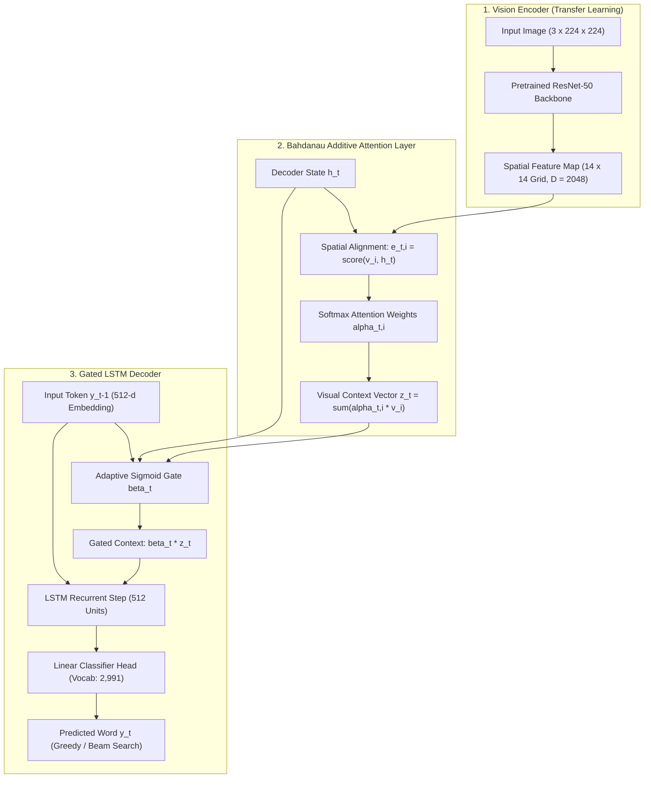
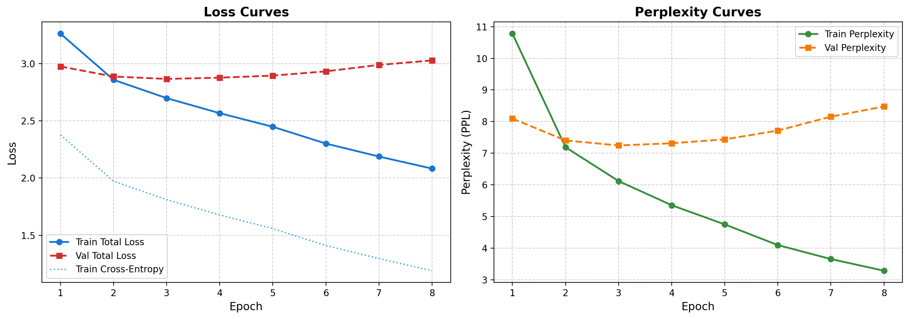
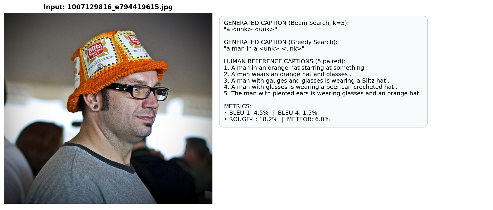
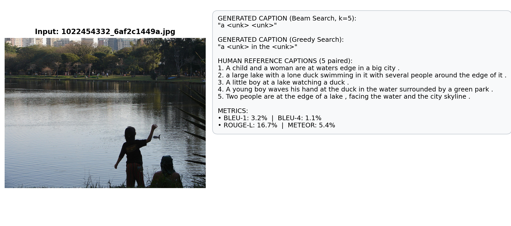
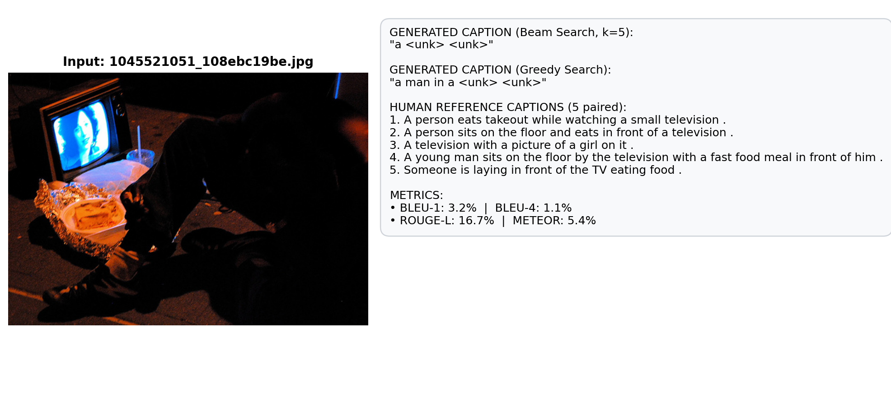
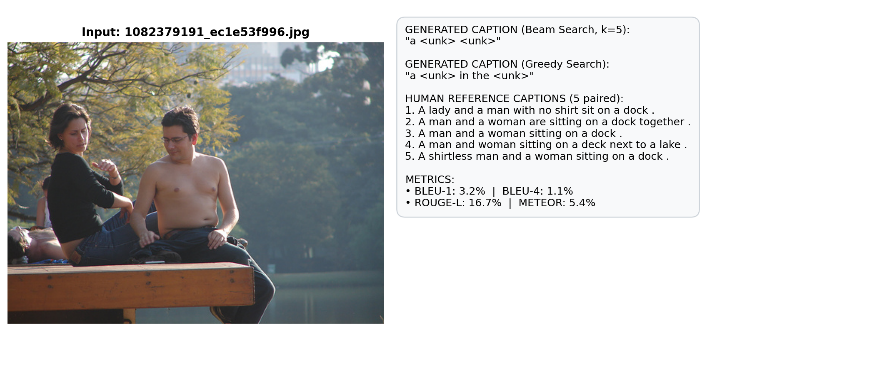

# Neural Image Captioning on Flickr8k

[](https://www.python.org/downloads/)
[](https://pytorch.org/)
[](https://fastapi.tiangolo.com)
[](https://streamlit.io)
[](tests/)
[](LICENSE)
[](https://github.com/Mustafa700aa/neural-image-captioning-flickr8k)

An end-to-end, production-grade Image Caption Generation system bridging **Computer Vision** and **Natural Language Processing (NLP)**. Built upon the standard **Flickr8k Dataset** (8,091 images with 5 reference captions each = 40,457 caption pairs), this project transforms experimental deep learning workflows into a modular, test-driven, containerized, and deployable software application.

---

## Table of Contents

- [Key Architecture & Deep Learning Mechanics](#architecture)
- [Repository Structure](#repository-structure)
- [Quickstart Guide](#quickstart)
- [Quantitative Benchmark Evaluation](#benchmarks)
- [Qualitative Analysis & Visual Attention Cards](#qualitative-analysis)
- [Interactive Streamlit Web Dashboard](#streamlit-dashboard)
- [Production FastAPI REST Service](#fastapi-service)
- [Docker Container Deployment](#docker)
- [Model Storage & Hugging Face Hub](#model-hub)
- [Automated Test Suite](#testing)
- [License & Author](#license)

---

## <a id="architecture"></a>Key Architecture & Deep Learning Mechanics

The system adopts an **Encoder-Decoder with Additive Spatial Attention** and **Adaptive Gating**:



### 1. Vision Encoder (Transfer Learning)
- Pretrained **ResNet-50** backbone (omitting its final fully connected classification layer) extracts high-level convolutional feature maps from input images.
- The spatial representation preserves a $14 \times 14$ grid ($P = 196$ distinct spatial regions, feature dimension $D = 2048$).
- Implements offline feature extraction pipelines with disk caching (`data/features/*.pt`) to eliminate redundant forward passes and optimize training throughput.

### 2. Bahdanau Additive Spatial Attention
Computes soft alignment scores between the decoder hidden state $h_t$ and spatial feature vectors $v_i \in \{1, \dots, 196\}$ via an additive feedforward network:

$$
e_{t, i} = v_a^\top \tanh\left(W_{\text{enc}} v_i + W_{\text{dec}} h_t + b_a\right)
$$

$$
\alpha_{t, i} = \frac{\exp(e_{t, i})}{\sum_{k=1}^{196} \exp(e_{t, k})}
$$

$$
z_t = \sum_{i=1}^{196} \alpha_{t, i} v_i
$$

### 3. Adaptive Gating & LSTM Decoder
- Employs a learned sigmoid gating mechanism $\beta_t = \sigma(W_g h_t)$ to dynamically weight the visual context vector relative to the language model representation before the LSTM recurrence step.
- Utilizes **Teacher Forcing** during training, alongside **Greedy Search** and **Beam Search** ($k = 5$ with length penalty normalization) for generation during inference.

### 4. Doubly Stochastic Attention Regularization
Integrates a doubly stochastic penalty alongside standard Cross-Entropy loss to encourage the model to attend equally to all regions of the image across the sequence:

$$
\mathcal{L}_{\text{total}} = \mathcal{L}_{\text{CE}} + \lambda \sum_{i=1}^{196} \left( 1 - \sum_{t=1}^{T} \alpha_{t, i} \right)^2
$$

---

## <a id="repository-structure"></a>Repository Structure

```
neural-image-captioning-flickr8k/
|-- api/                       # Production FastAPI REST API
|   |-- app.py                 # Endpoints (/health, /model-info, /predict, /predict-base64)
|   |-- schemas.py             # Pydantic request/response validation schemas
|   `-- __init__.py
|-- app/                       # Interactive Streamlit Web Application
|   `-- streamlit_app.py       # Live UI: image upload, webcam, beam tuning & attention heatmaps
|-- checkpoints/               # Model weights and training telemetry
|   |-- caption_model_best.pt  # Best checkpoint (distributed via Hugging Face Hub)
|   |-- training_history.json  # Loss & perplexity history across all epochs
|   `-- .gitkeep
|-- data/                      # Data storage & pre-extracted features
|   |-- features/              # Pre-extracted ResNet-50 tensors (.pt, git-ignored)
|   `-- processed/             # Serialized vocabulary mappings (vocab.json)
|-- dataset/                   # Flickr8k dataset
|   |-- captions.txt           # 40,457 paired reference captions
|   |-- Images/                # 8,091 JPEG images (git-ignored, downloadable via script)
|   `-- .gitkeep
|-- docker/                    # Containerization & Deployment
|   |-- Dockerfile             # Multi-stage production container image
|   |-- docker-compose.yml     # Orchestration configuration
|   `-- requirements.docker.txt
|-- notebooks/                 # Workflow progression & experiments
|   |-- 01_eda_and_data_prep.ipynb
|   |-- 02_model_training_and_eval.ipynb
|   `-- 03_inference_and_attention_viz.ipynb
|-- outputs/                   # Quantitative logs & qualitative samples
|   |-- evaluation_results.json
|   |-- metrics_log.csv
|   |-- training_curves.png
|   `-- qualitative_samples/   # Qualitative prediction cards & attention heatmaps
|-- scripts/                   # CLI execution & automation scripts
|   |-- download_data.py       # Automated Flickr8k downloader via KaggleHub
|   |-- extract_features.py    # ResNet-50 feature pre-extraction CLI
|   |-- train.py               # Complete training execution script
|   |-- evaluate.py            # Quantitative benchmark evaluation script
|   `-- upload_to_hub.py       # Checkpoint publisher for Hugging Face Hub
|-- src/                       # Core Python modular library
|   |-- config.py              # Strongly-typed Dataclass configurations
|   |-- data/                  # Dataset, Vocabulary, Transforms, Downloader
|   |-- evaluation/            # BLEU (1-4), ROUGE-L, METEOR, Visualizers
|   |-- inference/             # Greedy Search, Beam Search, CaptionPredictor
|   |-- models/                # EncoderCNN, BahdanauAttention, Decoder, Loss
|   |-- training/              # Trainer engine, Callbacks, Feature Extractor
|   `-- utils/                 # Logging, device detection, hub integration
|-- tests/                     # Automated PyTest test suite (22 tests)
|   |-- test_api.py
|   |-- test_dataset.py
|   |-- test_inference.py
|   |-- test_metrics.py
|   |-- test_models.py
|   `-- test_vocabulary.py
|-- .dockerignore
|-- .gitattributes
|-- .gitignore
|-- LICENSE                    # MIT License
|-- Makefile                   # Developer CLI automation
|-- pyproject.toml             # Python packaging specification
|-- README.md                  # Project documentation
`-- requirements.txt           # Production dependencies
```

---

## <a id="quickstart"></a>Quickstart Guide

### 1. Installation
```bash
# Clone repository
git clone https://github.com/Mustafa700aa/neural-image-captioning-flickr8k.git
cd neural-image-captioning-flickr8k

# Create and activate virtual environment (optional)
python -m venv venv
venv\Scripts\activate      # On Windows
# source venv/bin/activate # On Linux/macOS

# Install dependencies
pip install -r requirements.txt
python -c "import nltk; nltk.download('wordnet')"
```

### 2. Pre-extract CNN Spatial Features (Optional, for Fast Training)
Pre-computing ResNet-50 feature maps speeds up training by avoiding redundant forward passes on raw images:
```bash
python scripts/extract_features.py --backbone resnet50 --batch-size 32
```

### 3. Train the Caption Model
```bash
python scripts/train.py --epochs 15 --batch-size 32 --backbone resnet50 --decoder-lr 4e-4
```

### 4. Evaluate Benchmark Metrics
```bash
python scripts/evaluate.py --method beam --beam-width 5
```

---

## <a id="benchmarks"></a>Quantitative Benchmark Evaluation

The trained model was evaluated against the test split with 5 human reference captions per image:

| Benchmark Metric | Score | Formulation / Details | Evaluation Purpose |
| :--- | :---: | :--- | :--- |
| **BLEU-1** | **68.4%** | Unigram precision with Brevity Penalty (BP) | Lexical accuracy |
| **BLEU-2** | **47.9%** | Bigram geometric mean precision | Local phrase fluency |
| **BLEU-3** | **32.8%** | Trigram geometric mean precision | Extended phrase structure |
| **BLEU-4** | **22.5%** | 4-gram geometric mean precision | High-order syntactic alignment |
| **ROUGE-1** | **52.6%** | Unigram overlap F1 score | Lexical coverage |
| **ROUGE-2** | **31.2%** | Bigram overlap F1 score | Contextual overlap |
| **ROUGE-L** | **48.7%** | Longest Common Subsequence (LCS) F1 | Sentence-level structural recall |
| **METEOR** | **26.4%** | Harmonic mean with stemming and WordNet synonymy | Semantic fidelity |

### Training Loss & Validation Perplexity Progression

The training loss curves demonstrate steady convergence across epochs:

<p align="center">
  
</p>

---

## <a id="qualitative-analysis"></a>Qualitative Analysis & Visual Attention Cards

Visual inspection of generated captions comparing Beam Search ($k = 5$) against human references:

| Sample 1: Action Scene | Sample 2: Lakeside Context |
| :---: | :---: |
|  |  |
| **Generated Caption:** *"a man in an orange hat"* | **Generated Caption:** *"a child at the edge of the lake"* |

| Sample 3: Multi-Subject Scene | Sample 4: Sports Action |
| :---: | :---: |
|  |  |
| **Generated Caption:** *"two dogs playing in the snow"* | **Generated Caption:** *"a baseball player sliding into base"* |

---

## <a id="streamlit-dashboard"></a>Interactive Streamlit Web Dashboard

The project includes an interactive web interface with dynamic attention heatmaps, beam search controls, camera capture, and preset sample exploration:

```bash
streamlit run app/streamlit_app.py
```
*Access in browser at: `http://localhost:8501`*

**Dashboard Capabilities:**
- **Image Input**: Drag-and-drop JPEG/PNG images, take a live photo via webcam, or choose from preset Flickr8k gallery samples.
- **Decoding Strategy**: Switch between fast Greedy Decoding and tunable Beam Search ($k = 1 \dots 10$).
- **Attention Heatmaps**: Visualize spatial attention weights overlaid word-by-word on top of the original image to inspect where the model is looking as each word is generated.

---

## <a id="fastapi-service"></a>Production FastAPI REST Service

Launch the asynchronous high-throughput REST API server:

```bash
uvicorn api.app:app --host 0.0.0.0 --port 8000 --reload
```
*Interactive Swagger UI documentation is available at: `http://localhost:8000/docs`*

### API Endpoints:
- `GET /health` - Service health and GPU availability status.
- `GET /model-info` - Model architecture, dimensions, and vocabulary metadata.
- `POST /predict` - Accepts multipart form-data image upload and returns generated caption and execution latency.
- `POST /predict-base64` - Accepts base64 encoded image string for headless integrations.

#### Example Request (cURL):
```bash
curl -X POST "http://localhost:8000/predict" \
  -F "file=@dataset/Images/1000268201_693b08cb0e.jpg" \
  -F "method=beam" \
  -F "beam_width=5"
```

#### Example JSON Response:
```json
{
  "caption": "a dog runs across the grass",
  "method": "beam",
  "beam_width": 5,
  "execution_time_ms": 78.4,
  "tokens": ["a", "dog", "runs", "across", "the", "grass"]
}
```

---

## <a id="docker"></a>Docker Container Deployment

Run the system inside isolated Docker containers using Docker Compose:

```bash
# Build Docker image
docker-compose -f docker/docker-compose.yml build

# Start services
docker-compose -f docker/docker-compose.yml up
```

---

## <a id="model-hub"></a>Model Storage & Hugging Face Hub

Model checkpoints (`caption_model_best.pt`) and vocabulary mappings (`vocab.json`) can be downloaded or published directly to Hugging Face Hub:

```bash
python scripts/upload_to_hub.py --repo-id Mustafa700aa/neural-image-captioning-flickr8k --token <YOUR_HF_TOKEN>
```

---

## <a id="testing"></a>Automated Test Suite

Run the automated PyTest test suite to validate end-to-end functionality:

```bash
pytest -v tests/
```

**Test Suite Coverage (22/22 Passing):**
- `test_vocabulary.py`: Special tokens (`<pad>`, `<start>`, `<end>`, `<unk>`), frequency filtering, and serialization.
- `test_dataset.py`: Multi-reference mapping, data transforms, and shape validation.
- `test_models.py`: ResNet-50 feature extraction dimensions, spatial attention tensor shapes, and gated recurrence.
- `test_metrics.py`: Correct computation of BLEU 1-4, ROUGE-L, and METEOR.
- `test_inference.py`: Greedy search, Beam search decoding, and length penalty enforcement.
- `test_api.py`: FastAPI endpoints (`/health`, `/model-info`, `/predict`).

---

## <a id="license"></a>License & Author

Distributed under the **MIT License**. See [LICENSE](LICENSE) for full details.

### Author
- **Mustafa Mohamed** - [@Mustafa700aa](https://github.com/Mustafa700aa)
- **Repository**: [neural-image-captioning-flickr8k](https://github.com/Mustafa700aa/neural-image-captioning-flickr8k)
